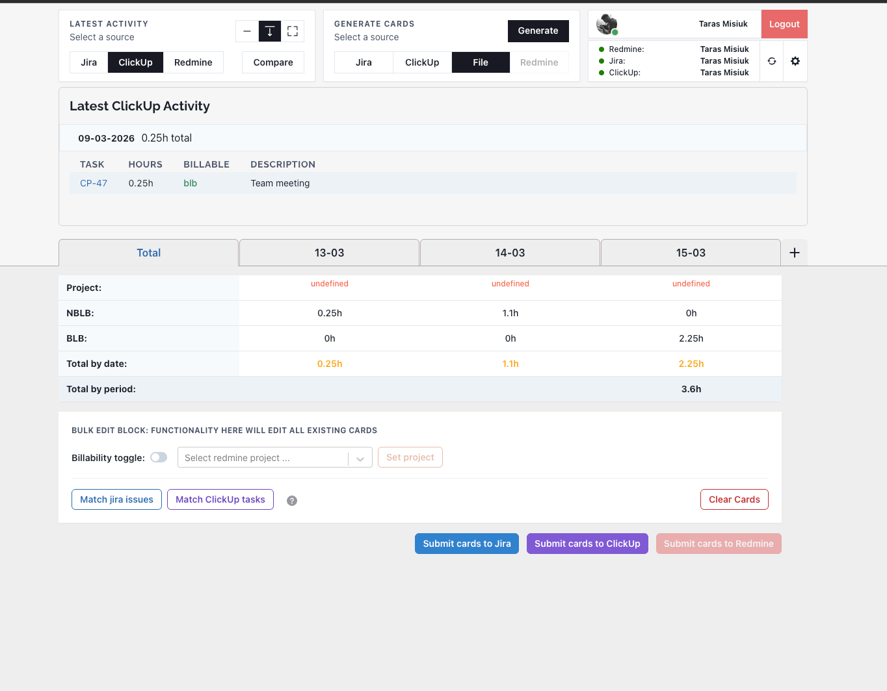
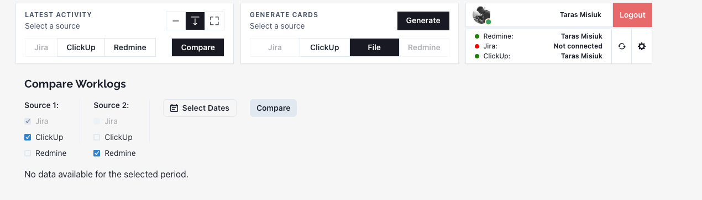
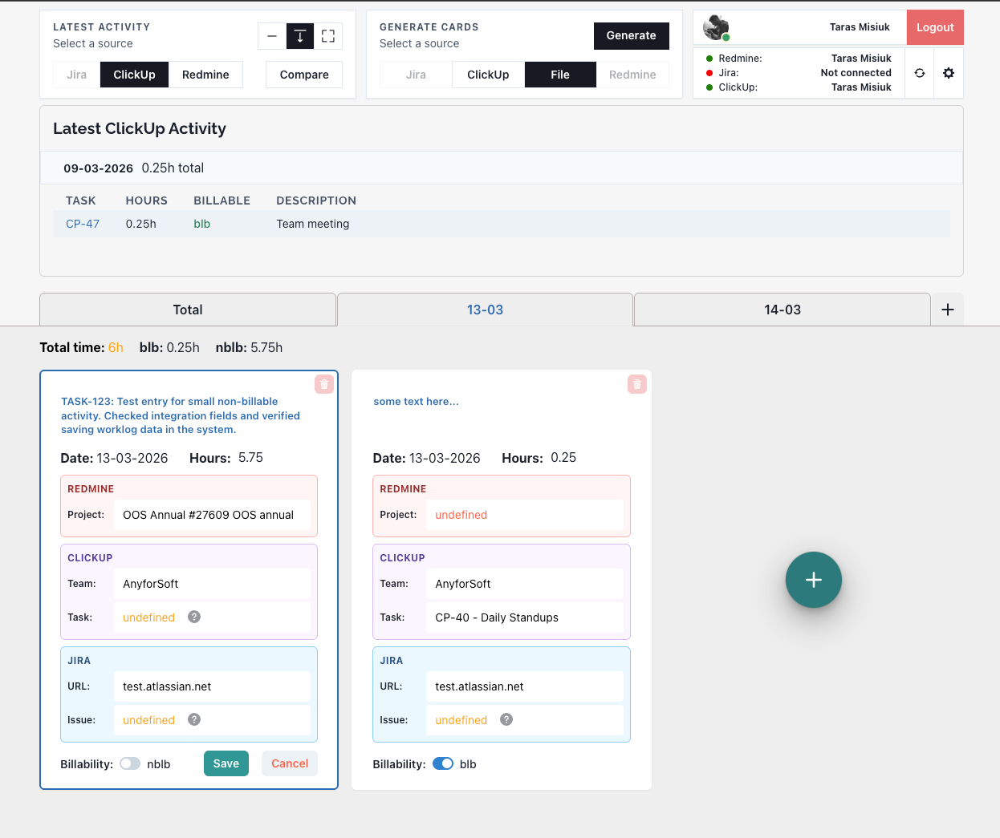

# Redmine Logger

Web app for logging time and managing work across **Redmine**, **Jira**, and **ClickUp**. One login (Firebase) gives you access to all integrations; the frontend talks to a Node backend that proxies requests to Redmine/Jira/ClickUp APIs.

**What you can do:**

- **Transfer worklogs** from one system to another — generate cards from existing logs and push them to Redmine, Jira, or ClickUp.
- **Single sign-on** — log in once and work with all connected integrations (including multiple instances, e.g. several Jira presets at once).
- **Compare worklogs** — view and compare time entries across systems in one place.

## Requirements

- **Node.js** 18 or later (LTS recommended)
- **Yarn** for the frontend

Check versions: `node -v` and `yarn -v`.

## Structure

- **react-app/** — Vite + React (Chakra UI, Zustand). Build output can be deployed to Firebase Hosting.
- **server/** — Express app (`server.js`). Handles auth, proxies to Redmine/Jira/ClickUp, file upload/parsing for worklog import.

## Local development

Run backend and frontend in parallel (two terminals). Install dependencies in **both** the server and the frontend before running.

1. **Environment**

   In `react-app/` create a `.env` file:

   ```
   VITE_BASE_URL=http://localhost:8000
   ```

   The frontend uses this as the API base URL.

2. **Backend**

   From the repo root:

   ```bash
   cd server
   npm install
   node server.js
   ```

   Server runs on port 8000 by default (check `server.js` if you change it).

3. **Frontend**

   In another terminal:

   ```bash
   cd react-app
   yarn install
   yarn dev
   ```

   Vite dev server runs on its own port (e.g. 5173). Open that URL in the browser; API requests go to `VITE_BASE_URL`.

Firebase and integration credentials (Redmine, Jira, ClickUp) are configured in the app settings or via your own env/backend config as needed.

---

## DEMO

<p align="center">
  
</p>
<p align="center"><em>Dashboard — overview and quick access</em></p>

<p align="center">
  
</p>
<p align="center"><em>Compare worklogs across Redmine, Jira, ClickUp</em></p>

<p align="center">
  
</p>
<p align="center"><em>Worklog — log time and manage entries</em></p>
