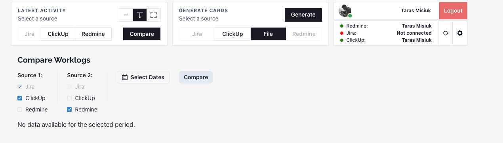
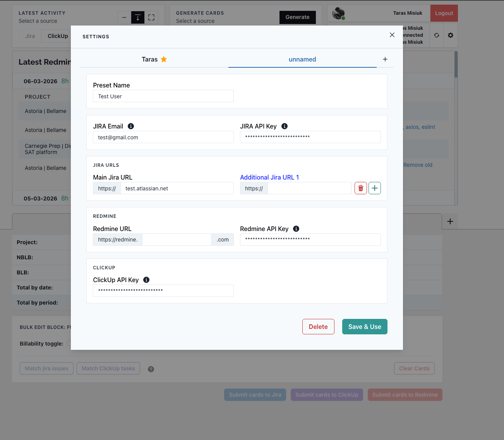

# Worklog Hub

Log time once and move it between **Redmine**, **Jira**, and **ClickUp**.

**[Live app](https://redmine-scheduler-app.web.app/)**

Agencies often run one tracker internally and another for the client, so the same hours get entered twice by hand. This app reads worklogs from one system, turns them into editable cards, and pushes them into another.

## What it does

- **Transfer** — pull existing logs from one tracker, adjust, push to another.
- **Compare** — put time entries from all connected systems side by side to catch gaps and double entries.
- **One login** — Firebase auth covers every integration, including several instances of the same tracker (multiple Jira presets, for example).
- **Bulk import** — upload a spreadsheet and the server parses it into worklog entries.

<p align="center">
  
</p>

## How it is put together

**`react-app/`** — Vite, React, Chakra UI, Zustand. Deployed to Firebase Hosting.

**`server/`** — Express. Proxies the three tracker APIs, parses uploaded spreadsheets with `xlsx`, and throttles outbound calls through `bottleneck` so a bulk transfer doesn't trip rate limits.

Credentials never reach the bundle: the frontend holds no tracker API keys, and every call goes through the backend.

<p align="center">
  
</p>

## Running locally

Node 18+ and Yarn. Two terminals.

Backend:

```bash
cd server
npm install
node server.js
```

Frontend — create `react-app/.env` with `VITE_BASE_URL=http://localhost:8000`, then:

```bash
cd react-app
yarn install
yarn dev
```

The server listens on port 8000. Tracker API keys and instance URLs are entered in the app's Settings screen after the first login.
