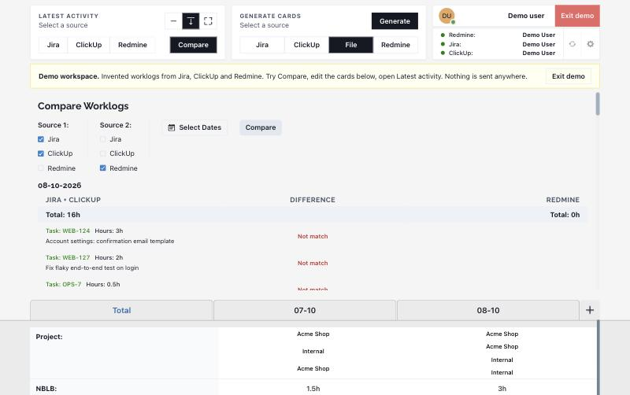
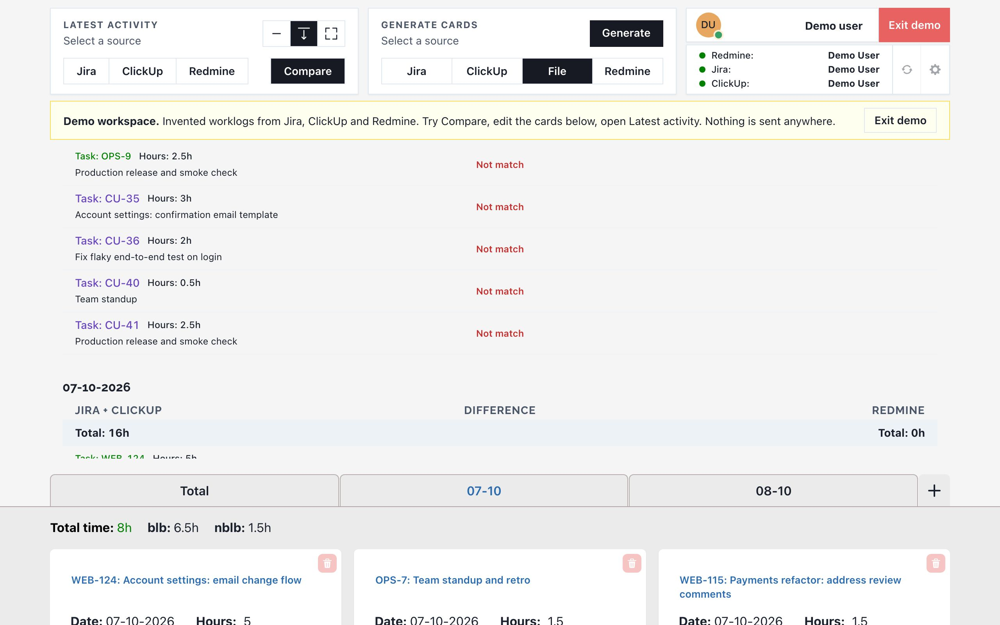

# Worklog Hub

Log your hours once, then move them between **Redmine**, **Jira** and **ClickUp** and see where the trackers disagree.

**[Open the live demo](https://misyuk-t.github.io/worklog-hub/)**: it opens straight into a workspace with invented data. No sign-in, and nothing is sent anywhere.



Teams that track time in one system for themselves and another for a client end up typing the same hours twice. Worklog Hub reads worklogs from one source, turns them into cards you can edit, and submits them to another tracker. Compare puts two sources side by side for a date range, so you can spot missing or mismatched entries.

## What it does

| | Redmine | Jira | ClickUp |
|---|---|---|---|
| Show your latest worklogs | yes | yes, across several Jira sites | yes, across teams |
| Generate cards from its worklogs | yes | yes | yes |
| Submit cards as worklogs | yes, with project and billable flag | yes, matched to issue keys | yes, matched to tasks |
| Compare against another tracker | yes | yes | yes |
| Edit or delete an entry from Compare | yes | yes | yes |

Cards can also come from a file:

- **TXT**: a date line `DD.MM`, then numbered entries ending in hours, e.g. `1. ABC-101: Fix login redirect 2h`.
- **XLSX**: an export from the JiraAssistant Chrome extension.

Jira keys and ClickUp task ids in a card's description are matched to issues and tasks automatically. Redmine projects can be set per card, in bulk, or through prefix mappings (`ABC-` → a Redmine issue).



## How credentials are handled

The app needs a personal API key for each tracker you connect. This is what the code does with them:

- **Storage.** Keys are saved in the Firebase Realtime Database of the app's Firebase project, in plain text, under your user record (`users/<id>/settings`). They are not encrypted at rest beyond what Firebase does. The rules in [`react-app/database.rules.json`](react-app/database.rules.json) let a signed-in user read and write only their own record.
- **Use.** The browser sends each request to the proxy server in [`server/`](server/) with the key in an `X-*` request header. The proxy calls the tracker's API over HTTPS with that key and returns the response. It does not store keys or log them. Error messages have keys masked.
- **Who can see them.** You, and whoever runs the Firebase project and the proxy server. For the hosted app that is the author. If that is not acceptable, run your own copy (below) with your own Firebase project and server.
- **The demo** sends nothing anywhere. All data is generated in the browser. It is a separate build (`VITE_DEMO=true`); the regular build has no demo mode.

Use keys with the narrowest access your tracker allows, and revoke them in the tracker when you stop using the app.

## Run it locally

Requirements: Node.js 18 or newer, Yarn 1 for the frontend, npm for the server.

```bash
git clone https://github.com/Misyuk-T/worklog-hub.git
cd worklog-hub

# 1. Proxy server, port 8000 (set PORT to change it)
cd server
npm install
node server.js

# 2. Frontend, in a second terminal
cd react-app
cp .env.example .env.local      # VITE_BASE_URL points at the server
yarn install
yarn dev
```

To look around without any setup, start the demo build instead. It opens on a workspace with invented data, needs no Firebase config and no server:

```bash
VITE_DEMO=true yarn dev
```

The public demo is published to GitHub Pages by `.github/workflows/pages.yml`, which builds with `VITE_DEMO=true VITE_BASE=/worklog-hub/`.

The regular `yarn dev` build is the real app. Open the URL Vite prints; without a Firebase config the sign-in button is disabled.

To sign in and use real trackers, create a Firebase project with Google sign-in and a Realtime Database, fill in the `VITE_FIREBASE_*` values in `react-app/.env.local`, and deploy the database rules:

```bash
cd react-app
firebase deploy --only database
```

Then sign in, open **Settings** (gear icon), paste your keys and tracker addresses, and press **Save & Use**.

## Project layout

- `react-app/`: Vite, React 18, Chakra UI, Zustand. Deployed to Firebase Hosting; the demo build goes to GitHub Pages.
- `server/`: Express proxy for the three tracker APIs. It parses TXT and XLSX imports and throttles calls with `bottleneck`.

## Checks

```bash
cd react-app && yarn test && yarn lint && yarn build
cd server && npm test
```

## Known limits

- The Redmine billable flag assumes a custom field with id 7 (values 1 and 3). Other Redmine setups need that mapping changed in `react-app/src/helpers/transformToRedmineData.js`.
- The interface is built for desktop. On phones the panels stack and the wide tables scroll sideways.

## License

[MIT](LICENSE)
